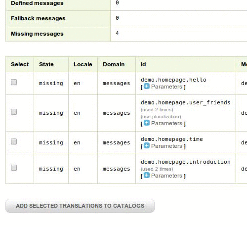

# Happyr Translation Bundle

[](https://github.com/Happyr/TranslationBundle/releases)
[](https://travis-ci.org/Happyr/TranslationBundle)
[](https://scrutinizer-ci.com/g/Happyr/TranslationBundle)
[](https://scrutinizer-ci.com/g/Happyr/TranslationBundle)
[](https://packagist.org/packages/happyr/translation-bundle)

This bundle helps you to integrate with a third party translation service. The bundle has been focused to integrate to 
the [Loco](https://localise.biz) service. If you want to know how Happyr work with this bundle you should check out 
[this blog post](http://developer.happyr.com/how-happyr-work-with-symfony-translations).

The key features of this bundle is: 

* Easy to download all translations from
* Support for multiple projects
* Create new translation assets by the Symfony WebProfiler
* Edit, flag and synchronize the translation via the Symfony WebProfiler 
* Auto upload missing translations to SaaS 

## Usage

To download all translations from Loco, simply run:
``` bash
php bin/console happyr:translation:download
```

When you have added new translations you may submit these to your translation SaaS by the WebProfiler toolbar.



You may also change translations and flag them from the same WebProfiler page. 


When you want to fetch new translations from your SaaS you should run the synchronize command. This command will
keep your current placeholders from missing translations. 

``` bash
php bin/console happyr:translation:sync
```

## Install

Install the bundle with `composer require happyr/translation-bundle`

You do also need to choose what library to use when you are sending http messages. Consult the [php-http/client-implementation](https://packagist.org/providers/php-http/client-implementation) virtual package to find adapters to use. For more information about virtual packages please refer to [Httplug](http://docs.httplug.io/en/latest/virtual-package/). Example:
```bash
php composer.phar require php-http/guzzle6-adapter
```
Enable the bundle in your kernel:

```
<?php
// app/AppKernel.php

public function registerBundles()
{
    $bundles = array(
        // ...
        new Happyr\TranslationBundle\HappyrTranslationBundle(),
    );
}
```

This bundle require you to register a service for the [HttpClient](https://github.com/php-http/httplug/blob/master/src/HttpClient.php)
and the [MessageFactory](https://github.com/php-http/message-factory/blob/master/src/MessageFactory.php) and then set 
service name to the config like below. The easiest way of doing this is with the [HttplugBundle](https://github.com/php-http/HttplugBundle).

``` yaml
happyr_translation:
  httplug_client: 'httplug.client'
  httplug_message_factory: 'httplug.message_factory'	
```

## Configure

If you have one Loco project per domain you may configure the bundle like this: 
``` yaml
# app/config/config.yml
happyr_translation:
  locales: ['en','sv','fr','es']
  projects:
    messages:
      api_key: 'foobar' 
    navigation:
      api_key: 'bazbar' 
```

If you just doing one project and have tags for all your translation domains you may use this configuration:
``` yaml

# app/config/config.yml
happyr_translation:
  locales: ['en','sv','fr','es']
  domains: ['messages', 'navigation']
  projects:
    acme:
      api_key: 'foobar'   
```

You do also need to configure a development route. 
``` yaml
# app/config/routing_dev.yml
_happyr_translation:
  resource: '@HappyrTranslationBundle/Resources/config/routing_dev.yml'  
```

### Default configuration
``` yaml
happyr_translation:
  httplug_client: 'httplug.client'
  httplug_message_factory: 'httplug.message_factory'	
  file_extension: 'xlf' # could be  'json', 'mo', 'php', 'po', 'yml' and many more
  locales: []
  domains: []
  translation_service: 'loco'
  target_dir: '%kernel.root_dir%/Resources/translations'
  auto_add_assets: false
  allow_edit: true
```

# TODO

* The new page in the WebProfiler needs some design and nice icons.
* The error handling is not always the best. 
  * The Loco class
  * In the HttpAdapters
  * In the javascript
  

# Credits

This bundle is both inspired by and is using some of the code from [@damienalexandre](https://github.com/damienalexandre) / [JoliCode](http://jolicode.com/blog/translation-workflow-with-symfony2)
and from Cliff Odijk's (@cmodijk) [LocoBundle](https://github.com/JCID/JcidLocoBundle).

I would also thank Tim Whitlock (@timwhitlock) for creating [Loco](https://localise.biz).
