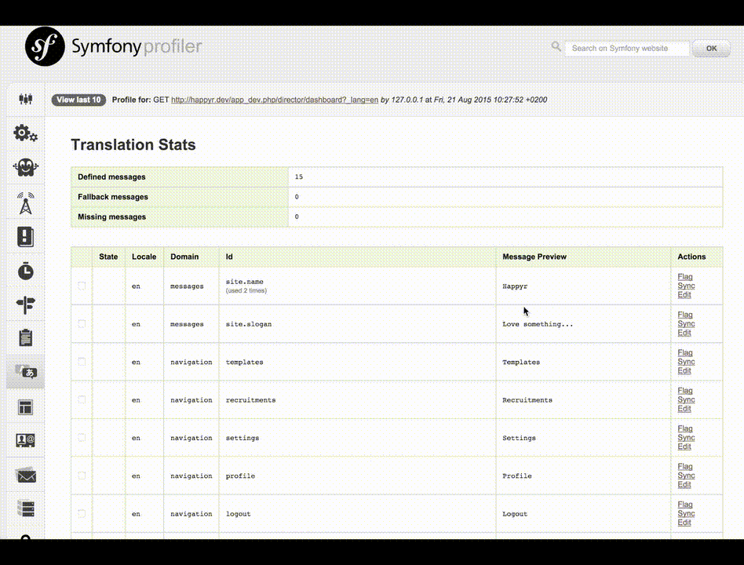

# Happyr Translation Bundle

This bundle helps you to integrate with a third party translation service. The bundle has been focused to integrate to 
the [Loco](https://localise.biz) service. If you want to know how Happyr work with this bundle you should check out 
[this blog post](http://developer.happyr.com/how-happyr-work-with-symfony-translations).

The key features of this bundle is: 

* Easy to download all translations from
* Support for multiple projects
* Create new translation assets by the Symfony WebProfiler
* Edit, flag and synchronize the translation via the Symfony WebProfiler 
* Auto upload missing translations to SaaS 

## Usage

To download all translations form logo, simply run: 
``` bash
php app/console happyr:translation:download
```

When you have added new translations you may submit these to your translation SaaS by the WebProfiler toolbar.


You may also change translations and flag them from the same WebProfiler page. 



When you want to fetch new translations from your SaaS you should run the synchronize command. This command will
keep your current placeholders from missing translations. 

``` bash
php app/console happyr:translation:sync
```

## Install

Install the bundle with `composer require happyr/translation-bundle`

## Configure

If you have one Loco project per domain you may configure the bundle like this: 
``` yaml
# /app/config/config.yml
happyr_translation:
  locales: ['en','sv','fr','es']
  projects:
    messages:
      api_key: 'foobar' 
    navigation:
      api_key: 'bazbar' 

```

If you just doing one project and have tags for all your translation domains you may use this configuration:
``` yaml

# /app/config/config.yml
happyr_translation:
  locales: ['en','sv','fr','es']
  dimensions: ['messages', 'navigation']
  projects:
    acme:
      api_key: 'foobar'  
    
```

You do also need to configure a development route. 
``` yaml
# /app/config/routing_dev.yml
_happyr_translation:
  resource: '@HappyrTranslationBundle/Resources/config/routing_dev.yml'
    
```

If composer installs guzzle 6+ please mind the following configuration:
``` yaml
happyr_translation:
  http_adapter: 'guzzle5' # << use this OR ...
  http_adapter: 'guzzle6' # << .. this depending on your installed guzzle version
```

### Default configuration
``` yaml

happyr_translation:
  file_extension: 'xlf'
  locales: []
  dimensions: []
  translation_service: 'loco'
  target_dir: '%kernel.root_dir%/Resources/translations'
  auto_add_assets: false
  allow_edit: true
  http_adapter: 'guzzle5'
```

You can choose local translation storage file type by changing the file_extension value in your config.yml.
As of now, PHP (php) and XLIFF (xlf) are supported (xlf is the default value).
If you choose another file type, you have to choose the appropriate Loader and Dumper in your service.yml.

Loader and Dumper for XLIFF resources (default)
``` yaml

services:
  # XLIFF Loader
  happyr.translation.loader:
    class: Symfony\Component\Translation\Loader\XliffFileLoader
    tags:
      - { name: 'translation.loader', alias: 'xliff' }

  # XLIFF Dump
  happyr.translation.dumper:
    class: Symfony\Component\Translation\Dumper\XliffFileDumper
    tags:
      - { name: 'translation.dumper', alias: 'xliff' }
```

Loader and Dumper for PHP resources
``` yaml

services:
  # PHP Loader
  happyr.translation.loader:
    class: Symfony\Component\Translation\Loader\PhpFileLoader
    tags:
      - { name: 'translation.loader', alias: 'php' }

  # PHP Dumper
  happyr.translation.dumper:
    class: Symfony\Component\Translation\Dumper\PhpFileDumper
    tags:
      - { name: 'translation.dumper', alias: 'php' }
```


# TODO

* The new page in the WebProfiler needs some design and nice icons.
* The error handling is not always the best. 
  * The Loco class
  * In the HttpAdapters
  * In the javascript
  

# Credits

This bundle is both inspired by and is using some of the code from [@damienalexandre](https://github.com/damienalexandre) / [JoliCode](http://jolicode.com/blog/translation-workflow-with-symfony2)
and from Cliff Odijk's (@cmodijk) [LocoBundle](https://github.com/JCID/JcidLocoBundle).

I would also thank Tim Whitlock (@timwhitlock) for creating [Loco](https://localise.biz).
